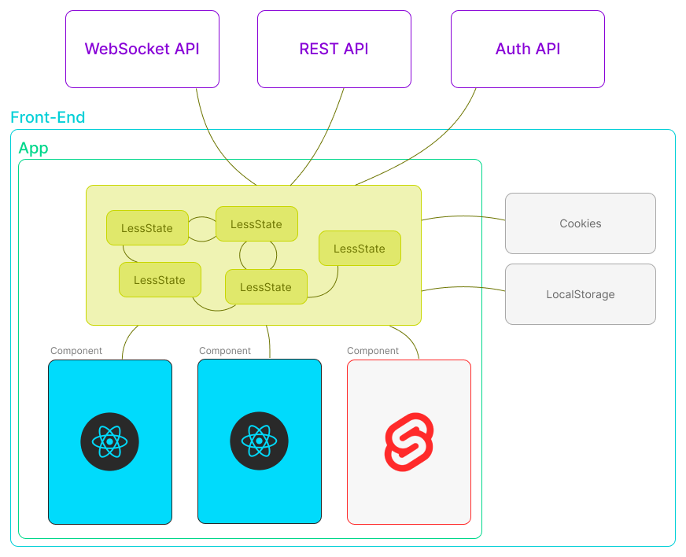

# Introduction

# Motivasion

# Por que usar clases para el manejo de estos?

Es mejor usar clases porque se pueden aprobechar todos los beneficios de la programacion orientada a objetos. Como la herencia o la composicion.

Podria llegar a servir en caso de que queramos tener dos instancias de un mismo componente, con estados separados, pero usando la misma implementacion (mismos metodos y atributos). O en caso de que queramos replicarlo pero agregando metodos nuevos o re-implementando los ya existentes. En general las clases son mas utiles a la hora de des-duplicar codigo.

Tengamos en cuenta que LessState no es solo para estados globales, sino que tambien para estados locales, y la idea es poder remplazar el uso de useState lo mas posible.

Resulta muy ventajoso poder acceder al estado de un componente por fuera de React. Muchas librerias funcionan por defecto programaticamente y no estan pensadas para ser usadas con React. Normalmente se suelen usar workarounds como wrapear las librerias en hooks adaptandolas al uso de useState, useEffect y useRef. Pero si manejamos el estado programaticamente con clases no necesitariamos esto. LessState es igualmente tambien compatible con las librerias que solo funcionan para React.

# Lo simple se vuelve titanico y solo para entendidos

Muchas veces hasta las tareas mas simples terminan siendo complicadas de implementar dentro del cuerpo de una funcion que se esta re-ejecutando constantement (basicamente esto es lo pasa dentro de los componentes React), algo tan basico como un GET o un POST a un endpoint muchas veces puede terminar siendo un dolor de cabeza, mas que nada cuando necesitamos usar auth o hacer llamados concatenados que depende de los estados.

Liberias como ReactQuery funcionan muy bien, pero tienen un grado de complejidad en su abstraccion que vuelve dificil el usarlo y mantener. Tambien hay que tener en cuenta que los estados solo son accesibles por dentro de React (por el momento desconozco si se pueden leer por fuera, pero no es el enfoque principal de la libreria). Tiene funciones de revalidacion que estan buenas, pero tambien podrian implementarse programaticamente con LessState (no implementado todavia).

# useEffect tentation

En lugar de "reaccionar" dentro de los componentes mejor usar listeners.

# App State Management

Podemos pensar el estado y las acciones como un proxy del lado del front-end que se encarga de gestionar todas las comunicaciones y notificar mediante eventos, tanto entre servicios externos como REST APIs o WebSockets, APIs del navegador como LocalStorake o Cookies y entre diferentes "islas" o componentes de diferentes frameworks.

# TODO: Mostrar ejemplos con formularios complejos, que incluyan data fetch.

# TODO: Ejemplos con WebSocket.
